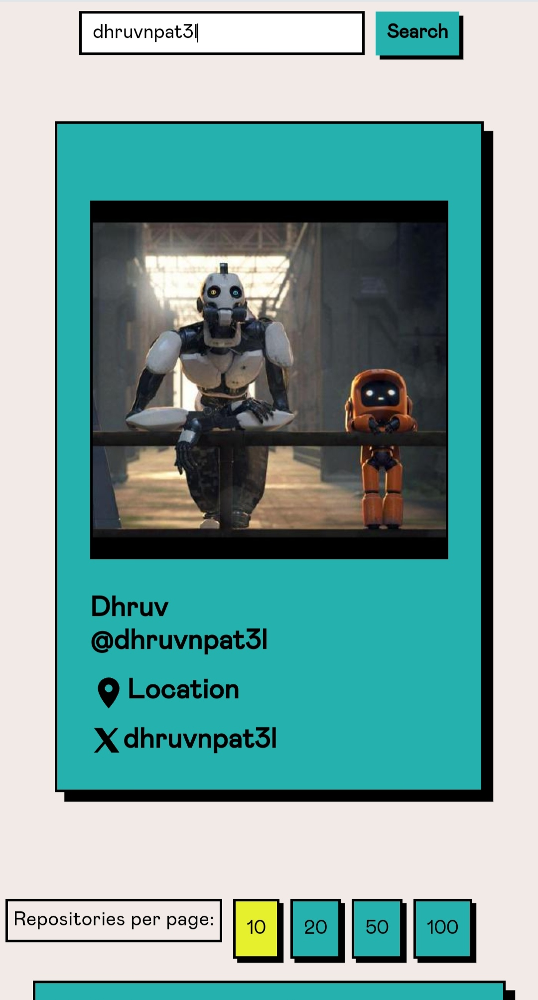
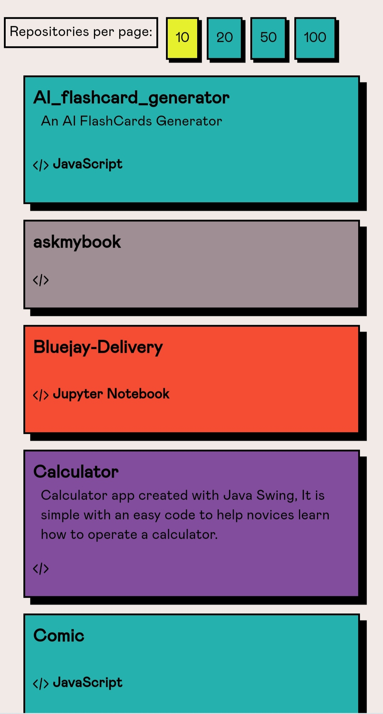
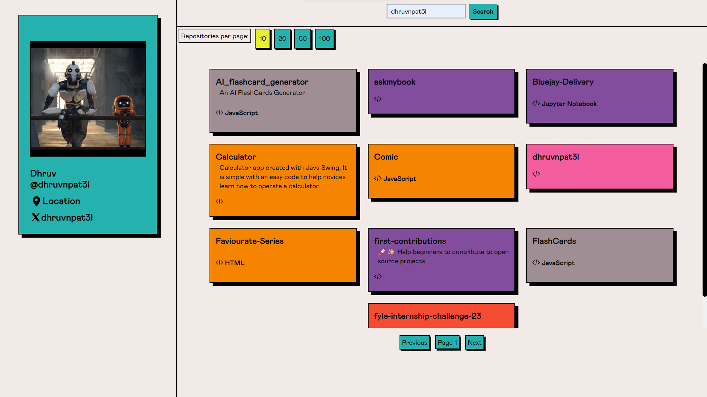

### 🚀 Explore GitHub Repositories with GithuBrowsr! 🌐🔍

GithuBrowsr is a dynamic website that leverages the power of the GitHub REST API to offer an immersive exploration of GitHub repositories associated with a specific user. Uncover the coding adventures, discover projects, and dive into the world of collaborative coding! 🚀🔧💻

## 🚀 Demo
Check out the live demo [here](https://repofind.vercel.app/) .

## 🚀 Galactic Setup: Unleash the Project Cosmos 🌌 (Installation 🚀)

1. **Grab a Local Copy:**

   First things first! Clone this awesome project to your local machine:

   ```bash
   git clone https://github.com/dontdude/fyle-internship-challenge-23.git

2. **Enter the Project Universe:**
   
   Navigate to the project's root directory and step into a world of possibilities:

   ```
   cd fyle-internship-challenge-23
   ```
3. **Summon Dependencies:**
  
   Use the magical npm spell to summon all the project dependencies:

    ```
   npm install
   ```
   Watch as npm conjures up the necessary potions to bring your project to life! 🧙✨

   That's it! Your quest to set up this project has begun. May your coding journey be as exciting as a heroic adventure! 🚀

## Launch the Spaceship 🚀

 **Start the Development Engines:**

   Ready for liftoff? Launch the development server and watch your project soar into the digital cosmos:

   ```
   ng serve
   ```
Now, your app is hosted at http://localhost:4200/. Embark on an interstellar journey through your project's universe! 🌌

## Testing Warp Drives 🚀🧪

1. **Initiate Quantum Tests:**

   Engage your project's testing warp drives! Execute the test suite using the power of Jasmine and Karma:

   ```
   ng test
   ```
   Watch as your unit tests navigate through the space-time continuum, ensuring the stability of your project's warp core.

   May your tests be as successful as a perfectly executed hyperspace jump! 🌌🚀

## Component Quantum Tests 🚀🛸

 Welcome to the interdimensional testing chamber, where your components become the heroes of their own epic saga! Follow these steps to ensure your components are ready to embark on their thrilling adventures:

 ### The Heroic Ritual:

1. **Summon the Testing Spirits:**

   Open the portal to the testing realm with the mighty command:

   ```
   ng test
   ```
 #### Individual Component Quests:

 1. **Select a Component Champion::**

    Choose a noble component as your champion for testing. Navigate to its domain:
    ```
    ng test --include=src/app/path-to-your-component/*.spec.ts
    ```
    Witness as your chosen component faces the trials set forth by the testing realm.

2. **Celebrate Victorious Components:**

    After a successful quest, celebrate your component's victories:

    ```
    ng test --include=src/app/path-to-your-component/*.spec.ts --code-coverage
    ```
    Revel in the glory of code coverage reports, as your components proudly display their conquered territories!

    May your components emerge victorious and bring peace to the realms of your application! 🏆🌌

## 📷 Screenshots


###  📱 Mobile View

#### Profile card


#### Reposiotry card


###  💻 Laptop View

#### Wathchlist 


## Technologies Used 🚀

- **Angular:** A platform and framework for building client-side applications.
- **RxJS:** A library for reactive programming using Observables, widely used in Angular applications.
- **Angular Material:** A UI component library for Angular that follows the Material Design principles.
- **HttpClient:** Angular's built-in module for making HTTP requests.
- **Jasmine and Karma:** Testing frameworks for writing and running unit tests in Angular.
- **Mockito (Jasmine SpyObj):** Used for creating spies and mocks in Jasmine tests.
- **HttpClientTestingModule:** Part of Angular testing utilities, provides a mock implementation of HttpClient for testing.
- **TypeScript:** A superset of JavaScript that adds static types to the language.

## Development Tools 🛠️

- **Visual Studio Code (VSCode):** A popular code editor with great support for Angular development.
- **Git:** Version control system for tracking changes in your codebase.
- **GitHub:** A platform for version control and collaboration, where this project is hosted.
- **npm:** Package manager for JavaScript/TypeScript, used for managing project dependencies.

## API 🌐

- **GitHub REST API:** Used to fetch user and repository data.